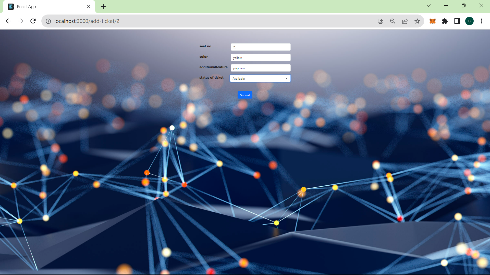

# Web3 Concert Ticket DApp - README

Welcome to the **Web3 Concert Ticket DApp** project repository! This decentralized application (DApp) leverages blockchain technology to implement an Concert Ticket platform on the Ethereum network. Participants can place bids on items of interest, and the highest bidder at the end of the Concert Ticket wins the item.

## Table of Contents

- [Overview](#overview)
- [Features](#features)
- [Getting Started](#getting-started)
  - [Prerequisites](#prerequisites)
  - [Installation](#installation)
- [Usage](#usage)
- [Smart Contracts](#smart-contracts)
- [Testing](#testing)
- [Frontend](#frontend)
- [Contributing](#contributing)
- [License](#license)

## Overview

The **Web3 Concert Ticket DApp** provides a user-friendly interface to participate in Ethereum-based Concert Ticket. This project ensures transparency and trust in the ticket booking process through the use of smart contracts.Admin has to first register and login to get the Dashboard.Admin can create ticket type,after ticketicket type is created he can create ticket of his choice by choosing seatno,color and additional features.He can chekout and checkin to show the availability of ticket

## Features

- Browse ticket purchase.
- book ticket of interest.
- Dynamic and responsive ui.
- Ethereum Wallet Integration: Connect your Ethereum wallet (e.g., MetaMask) to participate directly.

## Getting Started

Follow these steps to set up the project locally and start creating concert ticket.

### Prerequisites

1. Node.js: Ensure Node.js is installed. Download it from [nodejs.org](https://nodejs.org/).

### Installation

1. Clone the repository:

```bash
  git clone https://github.com/Lets-coD/Final-Project-solidity-and-bnb-bootcamp.git
```

2. Navigate to the project directory:

```bash
  cd Final-Project-solidity-and-bnb-bootcamp
```

3. Install required npm packages:

```bash
 npm install
```

## Usage

1. Start the development server:

```bash
 npm start
```

2. Open your web browser and navigate to `http://localhost:3000` to access the DApp.

3. Connect your Ethereum wallet (e.g., MetaMask) to the DApp.

4. Browse ongoing Concert Ticket, buy tickets, and monitor your Concert Ticket activity.

## Smart Contracts

The smart contracts in this project facilitate the Concert Ticket process. They handle bids, Concert Ticket creation, and winner determination. These contracts are deployed on the Ethereum blockchain.

- `ConcertTicket.sol`: Responsible for creating new ticket and purchase.

## Testing

Smart contract tests are located in the `test` folder. These tests ensure the correct functioning of the smart contract. To run the tests, follow these steps:

1. Open a terminal in the project directory.
2. Run the following command to execute the tests:

```bash
truffle test
```

This command will initiate the smart contract tests and display the results in the terminal.


## Frontend

The DApp frontend is built using modern web technologies including React.js. It provides an intuitive and interactive user interface for Concert Ticket participation.

- **React.js**: Powers the DApp's user interface.
- **Web3.js**: The Ethereum JavaScript API for smart contract interaction.
- **MetaMask**: A popular Ethereum wallet browser extension for secure transactions.




## Contributing

Contributions to this project are welcome! To contribute:

1. Fork the repository.
2. Create a new branch for your feature/bug fix.
3. Make changes and test thoroughly.
4. Commit with clear and concise messages.
5. Push changes to your fork.
6. Submit a pull request describing your changes.

## License

This project is licensed under the [MIT License](LICENSE).

---

Thank you for your interest in the Web3 Concert Ticket DApp project! For questions or suggestions, reach out to us or open an issue on [GitHub](https://github.com/Lets-coD/Final-Project-solidity-and-bnb-bootcamp.git). Happy bidding on the blockchain! 🚀

<br/>
important command<br/>
truffle unbox bnb-chain/BSC-Truffle-Starter-Box<br/>
npm i @openzeppelin/contracts@4.9.3<br/>
npm run compile<br/>
npm run test<br/>
npm run compile:bsc<br/>
npm run test:bsc bscTestnet<br/>
npm run migrate:bscTestnet<br/>
npx create-react-app dappConcertTicket<br/>
npm install -D tailwindcss<br/>
npx tailwindcss init<br/>
